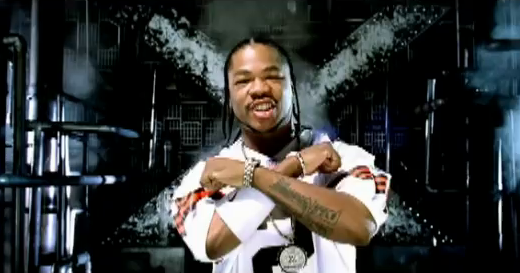

# ex

Exception handling library for clojure(+manifold)



## Api docs

* [](https://cljdoc.org/d/exoscale/ex/CURRENT/api/exoscale.ex) ex

* [](https://cljdoc.org/d/exoscale/ex-manifold/CURRENT/api/exoscale.ex.manifold) ex-manifold

* [](https://cljdoc.xyz/d/exoscale/ex-auspex/CURRENT/api/exoscale.ex.auspex) ex-auspex (completable future)

* [](https://cljdoc.xyz/d/exoscale/ex-http/CURRENT/api/exoscale.ex.http) ex-http

## Installation

[](https://clojars.org/exoscale/ex)

[](https://clojars.org/exoscale/ex-manifold)

[](https://clojars.org/exoscale/ex-auspex)

[](https://clojars.org/exoscale/ex-http)

## Rationale

* We want to be able to express/handle exceptions via `ex-info` in a
more formalised way.

* We want to be able to support java like exceptions hierarchies,
without having to define/extend classes.

* We want the shape of our custom `ex-info`s to be consistent.

* We want to have a default/generic categorization of `ex-info`s

* We don't want to differ from the original `try`/`catch`/`finally` semantics.

* We want to have the same mechanism for `manifold.deferred/catch`,
  `CompletableFuture`, optional via separate deps.

* We want to minimize any performance penalty it might have.

* We don't want to emit `catch Throwable`, stay as close as possible
  to what the user would write by hand.

## How

This is an exception library, drop in replacement for
`try`/`catch`/`finally`, that adds support for `ex-info`/`ex-data`
with a custom clojure hierarchy that allows to express exceptions
relations. It also comes with manifold support.

So we have `exoscale.ex/try+`, which supports vanilla `catch`/`finally`
clauses.

If you specify a `catch` clause with a keyword as first argument
things get interesting. **We assume you always put a `:type` key in
the ex-infos you generate**, and will match its value to the value of
the key in the `catch` clause.

### The basics

Essentially `catch` takes this form:

```clj
(catch :something m
   ;; where m is a binding to the ex-data (you can destructure at that level as well)
   )
```

So you can do things like that.

```clj

(require '[exoscale.ex :as ex])

(ex/try+

  (throw (ex-info "Argh" {:type ::bar :foo "a foo"}))

  (catch ::foo data
    (prn :got-ex-data data))

  (catch ::bar {:as data :keys [foo]}
    ;; in that case it would hit this one
    (prn :got-ex-data-again foo))

  (catch ExceptionInfo e
   ;; this would match an ex-info that didn't get a hit with catch-ex-info)

  (catch Exception e (prn :boring))

  (finally (prn :boring-too)))

```

### Exception hierarchies

We leverage a clojure hierarchy so you can essentially create
exceptions relations/extending without having to mess with Java
classes directly.

```clj
;; so bar is a foo

(ex/derive ::bar ::foo)

(ex/try+
  (throw (ex-info "I am a bar" {:type ::bar})
  (catch ::foo d
    (prn "got a foo with data" d)
    (prn "Original exception instance is " (-> d meta ::ex/exception))))

```

### Manifold support

We have `exoscale.ex.manifold/catch` that matches the semantics
of a `catch` block in `try+` but with a more manifold like feel.

```clj
(require '[exoscale.ex.manifold :as mx])
(require '[manifold.deferred :as d])

(-> (d/error-deferred (ex-info "boom" {:type :bar}))
    (mx/catch :bar (fn [data] (prn "ex-data is: " data)))
    (d/catch (fn [ex] "... regular manifold handling here")))
```

### Specing your ex-infos data

You can specify a clojure.spec for the `ex-data` via the multimethod at
`:exoscale.ex/ex-data-spec` or via the sugar fn provided
`exoscale.ex/set-ex-data-spec!`:

```clj
(ex/set-ex-data-spec! ::foo (s/keys :req [...] :opt [...]}))]}))`
```

By default this is enforced via `clojure.spec/assert`, meaning unless
you toggled it "on" explicitely, it will be off.

You can change this behavior and set the validator to something else
like a log statement:

```clj
(ex/set-validator!
  (fn [data]
    (when-not (s/valid? ::ex/ex-data)
      (log/warnf "ex-data caught doesn't match the spec for it's :type : %s" data))))
```

It is strongly discouraged to make this validation breaking the flow
of execution in production as this would only show up at "catch time".

### How to get to the original exception

You can also get the full exception instance via the metadata on the
ex-data we extract, it's under the `:exoscale.ex/exception` key.
If you are within a `try+` block you can also access it directly via
`&ex`

###  Our default internal `:type`s table

We suggest you also either use one of these as `:type` or derive your
own with these.

Within the namespace `:exoscale.ex`:

| category | retry | fix
| ---- | ---- | --- |
| :unavailable | yes | make sure callee healthy |
| :interrupted | yes | stop interrupting |
| :incorrect | no | fix caller bug |
| :forbidden | no | fix caller creds |
| :unsupported | no | fix caller verb |
| :not-found | no | fix caller noun |
| :conflict | no | coordinate with callee |
| :fault | no | fix callee bug |
| :busy | yes | backoff and retry |

This is very much inspired by
[cognitect-labs/anomalies](https://github.com/cognitect-labs/anomalies).

We have simple wrappers to create ex-info based on this:
`ex/ex-unavailable`, `ex/ex-interrupted` and so on. Their signature is
identical to `ex-info` otherwise. An `ex-http/response->ex-info` utility function that maps HTTP status codes onto this taxonomy is available in the `ex.http` namespace.

## How to generate/use good ex-infos

* Specify a `:type` key **always**

* The type key should either be one of our base type or a descendent.
  Descendents should be avoided when possible.

* If it's a rethrow or comes from another exception pass the original
  exception as `cause` (3rd arg of `ex-info`)

* Have logging in mind when you create them. It's easier to pull
  predefined set of values from ELK or aggregate than searching on a
  string message.

* `ex-info`s should contain enough info but not too much (don't dump a
  system/env map on its ex-data).

* Preferably select the data you want to show in your ex-data instead
  of removing what you want to hide. If for some reason secrets end up
  in the upstream data source at least there's is no risk of leaking
  them with the exception that way.

* If you use more than once the same `:type` you might want to spec it

* Avoid returning raw values in error-deferreds, return properly
  formated ex-infos
  `(d/error-deferred ::foo) vs (d/error-deferred (ex-info ".." {...}))`

* Do not leak data that is meant to emulate a usage context
  (cloudstack error codes, http status codes). That should be handled
  by a middleware at the edge.

## Helpers

We have a few helpers


* `exoscale.ex/ex-info`.

    ```clj
    ;; shortest, just a msg and {:type ::incorrect}
    (ex/ex-info "Oh no" ::incorrect)

    ;; same with some ex-data
    (ex/ex-info "Oh no" ::incorrect {:foo :bar})

    ;; same with cause
    (ex/ex-info "Oh no" ::my-error {:foo :bar} cause)

    ;; including derivation
    (ex/ex-info "Oh no" [::foo [::incorrect ::sentry-loggable]])

    (ex/ex-info "Oh no" [::foo [::incorrect ::sentry-loggable]] {...})
    ```

* `ex/ex-unavailable`,`ex/ex-interrupted`, etc

    They are just shortcuts to `ex-info` with preset :type matching our
    base type table and built in validation.

    ```clj
    (throw (ex/ex-unavailable "Cannot reach foo" {:because :this}))
    ```

* for testing you can use in `exoscale.ex.test` `thrown-ex-info-type?` similar to `thrown?` in clojure.test.

   ```clj
   (is (thrown-ex-info-type? ::foo (throw (ex-info "boom" {:type ::foo})))) -> true
   ```
   It dispatches via `try+/catch`, so relations are supported.

* we support turning these kind of ex-infos into data via `clojure.core.protocols/datafy`
  and back into exceptions via `exoscale.ex/map->ex-info`.


```clj
=> (clojure.core.protocols/datafy (ex/ex-incorrect "boom" {:a 1} (ex/ex-incorrect "the-cause")))
#:exoscale.ex{:type :exoscale.ex/incorrect
              :message "boom"
              :data {:a 1, :type :exoscale.ex/incorrect}
              :deriving #{:exoscale.ex/foo :exoscale.ex/bar}
              :cause #:exoscale.ex{:type :exoscale.ex/incorrect
                                   :message "the-cause"
                                   :data {:type :exoscale.ex/incorrect}
                                   :deriving #{:exoscale.ex/foo :exoscale.ex/bar}}

=> (type (ex/map->ex-info *1))
clojure.lang.ExceptionInfo

```

## Usage examples

Some real life examples of usage for this:

* Deny all display of user exceptions to the end-user by default via
  top level middleware and only let through the ones marked safe to
  show via a derived :type.

* Skip sentry logging for some kind of exceptions (or the inverse)
